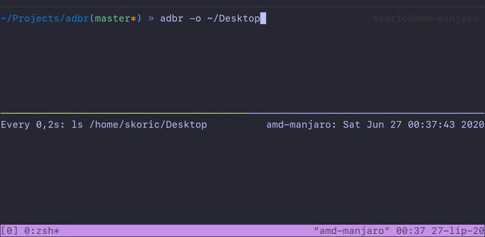

# Android Debug Bridge Recorder (adbr)

The `adbr.sh` is a small bash script that will allow you to easily record Android device/emulator screen. It allows you to take many screen recording by just pressing a key in the terminal.

### Features

- Take a screen recording from connected device/emulator with one key press
- Specify an output directory for the recordings
- Automatically clean the temporary recording from the device

### Sample

See the sample of the recording process:



### Usage

* **-o** Specify output directory for recordings, e.g. `adbr -o ~/Desktop/test_dir`
* **-h** Print help
* **-v** Print version

Once the program is running, press any key to start/stop recording, or 'q' to exit.

### Installation (Linux and MacOS)

1) Make sure you have ADB in your path. You can add it to your shell config file (`.bash_profile`, `.zshrc`, etc.):

```sh
# Your ADB might be different, these are just common locations.

# Linux
export PATH=${PATH}:$HOME/Android/Sdk/platform-tools/

# MacOS
export PATH=${PATH}:$HOME/Library/Android/sdk/platform-tools/
```

2) Make sure you have `ffmpeg` installed:

```
# MacOS
brew install ffmpeg

# Debian/Ubuntu
apt-get install ffmpeg

#Arch
pacman -S ffmpeg
```

3) Check that you have a device/emulator connected to the ADB by running `adb devices`. Output should look like this:

```sh
List of devices attached
emulator-5554   device 
```

4) You can simply download `adbr.sh` and use it however you like. This is simpler example for nicer integration and easier updates:

```sh
# Clone adbr repo to your home directory.
git clone https://github.com/skoric/adbr.git ~/adbr

# Create alias in your shell config file ('.bash_profile', '.zshrc', etc.).
echo "alias adbr=\"sh $HOME/adbss/adbr.sh\"" >> ~/.zshrc

# Reload configuration.
source ~/.zshrc

# Start taking screenshots.
adbr
```

If you've used the git repo in your setup, you can update by simply calling `git pull` in local repo directory.
